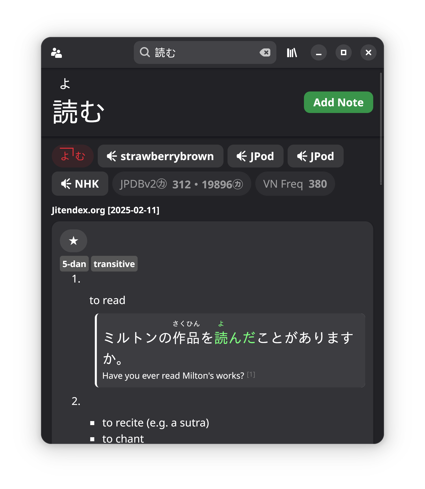

I'm a programmer based in the UK who's been programming since 2018. I got my start in Java through Minecraft modding, and later moved on to lower-level programming with Rust. Currently I'm developing my Rust skills, and looking at lower-level embedded programming, as well as high-level sysadmin and DevOps tools.

# What I've built

<table>
<tr>
<td width="40%">

</td>
<td>

### 🔌 [aeronet](https://github.com/aecsocket/aeronet)

Low-level networking library for the [Bevy game engine](https://github.com/bevyengine/bevy) written in Rust focused on reliability, robustness, and modularity with higher-level components. Compatible with other ecosystem crates like [bevy_replicon](https://github.com/projectharmonia/bevy_replicon).

</td>
</tr>
</table>

<table>
<tr>
<td>

### 🧲 [rattle](https://github.com/aecsocket/rattle)

Physics mod for Minecraft written in Kotlin, integrating via C-Java FFI to [Jolt Physics](https://github.com/jrouwe/joltphysics). Allows developers to add their own physics objects which seamlessly interact with blocks and entities. Available as a [Paper plugin](https://papermc.io/) (no client mods required), or a [Fabric mod](https://fabricmc.net/).

</td>
<td width="40%">

</td>
</tr>
</table>

...and a ton of other things:

- [fukomaster](https://github.com/aecsocket/fukomaster) - lets your [MX Master 3S](https://www.logitech.com/en-us/shop/p/mx-master-3s.910-006556) use trackpad gestures for your Linux desktop
- [const-exhaustive](https://github.com/aecsocket/const-exhaustive) - enumerate all values of a Rust type at compile time
- [Bevy](https://github.com/bevyengine/bevy/) contributor
- [jolt-java](https://github.com/aecsocket/jolt-java) - Java/C/C++ FFI bindings for [Jolt Physics](https://github.com/jrouwe/joltphysics)
- [cpu-features-java](https://github.com/aecsocket/cpu-features-java) - Java/C FFI bindings for [google/cpu_features](https://github.com/google/cpu_features)

# What I'm building

<table>
<tr>
<td width="40%">

</td>
<td>

### 📖 wordbase

Pop-up dictionary engine and app for desktop, built using GTK and Adwaita via [Relm4](https://relm4.org/). Inspired by [Yomitan](https://github.com/yomidevs/yomitan/) and [JL](https://github.com/rampaa/jl), but exposes an API, allowing 3rd party developers to integrate the dictionary into their own apps.

</td>
</tr>
</table>

<table>
<tr>
<td>

### 🚅 metrostack

Mini train station software stack, covering everything from the microcontroller at station gates to read your transit card (embedded Rust via [esp-hal](https://github.com/esp-rs/esp-hal)), up to the control plane which talks to the transit database ([axum](https://docs.rs/axum/latest/axum/) microservice).

</td>
</tr>
</table>

<table>
<tr>
<td>

### 💻 my homelab and personal website

Built and deployed using NixOS, running my internal services, and hosting my blog posts. Currently under maintenance - preview coming soon!

</td>
</tr>
</table>

# Outside of programming

- ✒️ Occasionally writing blog posts for my website
- 🥊 Boxing
- ✈️ Travelling
- 🗣️ Foreign languages 

    
